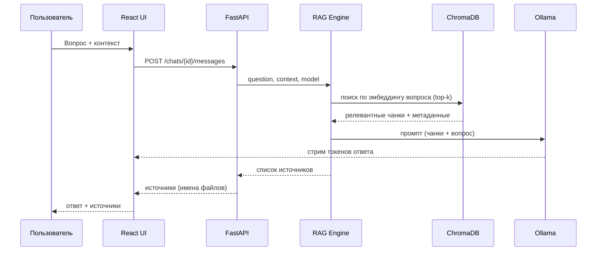
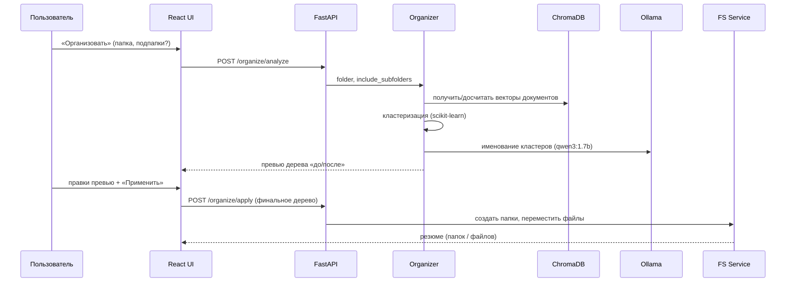

# memo — Логика компонентов и взаимодействий

> Документ описывает внутреннюю логику модулей backend, потоки данных по сценариям, схемы хранилищ и контракт REST API между UI и backend.

---

## 1. Карта модулей backend

| Модуль | Зона ответственности |
|---|---|
| Document Loader | Извлечение текста из файлов (PDF, DOCX, MD, TXT) |
| Indexer | Чанкинг, эмбеддинг, запись в ChromaDB, учёт состояния индекса |
| File Watcher | Отслеживание изменений файлов, инвалидация индекса |
| RAG Engine | Q&A: retrieval + генерация ответа с источниками |
| Organizer | Авто-организация: кластеризация + именование + перемещение |
| Doc Generator | Создание новых .txt/.md документов |
| Chat Store | CRUD чатов и сообщений, генерация названий |
| Ollama Client | Единая точка обращения к Ollama (list / generate / embed) |
| FS Service | Чтение дерева файлов, перемещение, создание папок |

---

## 2. Document Loader

**Вход:** путь к файлу.
**Выход:** plain-текст + метаданные (`file_path`, `file_name`, `mtime`, `file_hash`).

Логика по типам:
- `.pdf` → PyMuPDF извлекает текст постранично.
- `.docx` → python-docx собирает текст из параграфов.
- `.md`, `.txt` → прямое чтение.
- Неподдерживаемый формат → ошибка со статусом, файл помечается ❌.

Извлечённый текст кэшируется по паре (`file_path`, `file_hash`), чтобы повторный парсинг не выполнялся, пока файл не изменился.

---

## 3. Indexer

**Вход:** список файлов (или папка + флаг подпапок).

Логика для каждого файла:
1. Проверка состояния: если `file_hash` совпадает с сохранённым в `index_state` — файл пропускается (инкрементальность).
2. Загрузка текста через Document Loader.
3. Чанкинг: ~512 токенов, перекрытие ~64.
4. Эмбеддинг чанков моделью `bge-m3` (батчами).
5. Запись векторов в ChromaDB с метаданными (`file_path`, `file_name`, `chunk_index`, `file_hash`).
6. Обновление записи в `index_state`: статус `indexed`, новый `file_hash`, `mtime`, число чанков.

Прогресс публикуется для UI (счётчик `обработано / всего`).

---

## 4. File Watcher

Работает на `watchdog`, следит за проиндексированными путями.

| Событие | Реакция |
|---|---|
| Файл изменён | Сравнение нового хэша с сохранённым; при отличии — статус файла в `index_state` → `stale` (⚠️) |
| Файл удалён | Удаление его векторов из ChromaDB и записи из `index_state` |
| Файл переименован/перемещён | Обновление `file_path` в метаданных и `index_state` |

Watcher не переиндексирует сам — только помечает. Решение о переиндексации принимает пользователь (UC-01) или RAG Engine (автоиндексация перед ответом).

---

## 5. RAG Engine

**Вход:** вопрос, спецификация контекста (папка / файлы / нет), выбранная модель.

### Логика с контекстом
1. Если файлы контекста не проиндексированы — запускается индексация (Indexer).
2. Вопрос эмбеддится моделью `bge-m3`.
3. Векторный поиск в ChromaDB, отфильтрованный по путям контекста → top-k чанков (k = 4–6).
4. Сборка промпта: системная инструкция + найденные чанки + вопрос.
5. Вызов Ollama (модель пользователя), ответ **стримится** в UI.
6. Из метаданных найденных чанков собирается список уникальных имён файлов-источников.
7. Возврат: ответ + источники.

### Логика без контекста
Вопрос передаётся в Ollama напрямую, без retrieval. Источники не возвращаются.

### Граничные случаи
- Релевантные чанки не найдены → ответ «В выбранных документах не найдено информации по этому вопросу».
- В контексте есть `stale`-файлы → ответ сопровождается предупреждением об устаревшем индексе.
- Ollama недоступна → ошибка «Убедитесь, что Ollama запущена».

### Поток Q&A

---

## 6. Organizer

**Вход:** папка, флаг «включая подпапки».

Оптимизированный конвейер (минимум вызовов LLM):

1. **Сбор файлов** в папке (с учётом флага подпапок).
2. **Получение векторов:** для проиндексированных файлов переиспользуются эмбеддинги из ChromaDB; для остальных вычисляется документный вектор (усреднение векторов чанков). Повторного эмбеддинга не происходит.
3. **Кластеризация** документных векторов (scikit-learn; число кластеров подбирается автоматически, например по silhouette score). Документы-выбросы помечаются как некластеризуемые.
4. **Именование кластеров:** для каждого кластера выбираются репрезентативные документы → один вызов `qwen3:1.7b` на кластер для генерации имени папки. (Fallback без LLM: имя из топ TF-IDF ключевых слов.)
5. **Папка «Разное»:** документы-выбросы помещаются туда.
6. **Сборка превью** дерева «до/после» → возврат в UI.
7. **Применение (по подтверждению):** FS Service создаёт папки и перемещает файлы. До этого шага диск не изменяется.

Структура плоская (один уровень). Сами файлы не переименовываются.

### Поток авто-организации

---

## 7. Doc Generator

**Вход:** запрос, формат (`.txt` / `.md`), опциональный контекст, модель.

Логика:
1. Если задан контекст — retrieval релевантных чанков (как в RAG) и добавление их в промпт.
2. Сборка промпта с инструкцией по формату:
   - `.md` → модель применяет Markdown-разметку (заголовки, списки, выделение).
   - `.txt` → plain text без разметки.
3. Вызов Ollama (модель пользователя), генерация **стримится** в превью.
4. Для `.md` превью рендерится как Markdown.
5. **Сохранение (по подтверждению):** имя файла предлагается автоматически (из первого заголовка/темы), пользователь может изменить; FS Service записывает файл в текущую папку.

Существующие файлы не редактируются. Без подтверждения файл не сохраняется.

---

## 8. Chat Store

CRUD чатов и сообщений в SQLite.

- **Создание чата:** пустой чат с моделью и (опционально) контекстом.
- **Название:** генерируется из первого вопроса пользователя (усечение или короткий вызов LLM); редактируется пользователем в любой момент.
- **Сообщения:** сохраняются с ролью (`user` / `assistant`), содержимым и списком источников (для ответов).
- **Персистентность:** история доступна между сессиями.

---

## 9. Схемы хранилищ

### 9.1 SQLite

**Таблица `chats`**

| Поле | Тип | Описание |
|---|---|---|
| id | PK | Идентификатор чата |
| title | text | Название (редактируемое) |
| model | text | Выбранная модель Ollama |
| context_type | text | `folder` / `files` / `none` |
| context_paths | json | Пути папки или файлов контекста |
| include_subfolders | bool | Флаг подпапок |
| created_at / updated_at | datetime | Временные метки |

**Таблица `messages`**

| Поле | Тип | Описание |
|---|---|---|
| id | PK | Идентификатор сообщения |
| chat_id | FK → chats.id | Принадлежность чату |
| role | text | `user` / `assistant` |
| content | text | Текст сообщения |
| sources | json | Список имён файлов-источников (для ответов) |
| created_at | datetime | Временная метка |

**Таблица `index_state`**

| Поле | Тип | Описание |
|---|---|---|
| file_path | PK | Путь к файлу |
| file_hash | text | Хэш содержимого (для инкрементальности) |
| mtime | datetime | Время изменения |
| status | text | `indexed` / `stale` |
| chunk_count | int | Число чанков |
| indexed_at | datetime | Время индексации |

### 9.2 ChromaDB

Коллекция `documents`. Каждая запись:
- вектор (эмбеддинг чанка, bge-m3);
- текст чанка;
- метаданные: `file_path`, `file_name`, `chunk_index`, `file_hash`.

Фильтрация по `file_path` обеспечивает ограничение retrieval рамками выбранного контекста.

---

## 10. Контракт REST API

База: `http://localhost:{port}`. Все ответы — JSON; ответы генерации стримятся.

### Модели
| Метод | Путь | Назначение |
|---|---|---|
| GET | /models | Список установленных в Ollama моделей |

### Индексация
| Метод | Путь | Назначение |
|---|---|---|
| POST | /index | Индексировать файлы/папку (тело: пути, флаг подпапок) |
| GET | /index/status | Статусы индекса по путям (indexed / stale / none) |
| POST | /index/refresh-stale | Переиндексировать все `stale`-файлы |

### Файловая система
| Метод | Путь | Назначение |
|---|---|---|
| GET | /fs/tree | Дерево файлов/папок для левой панели |

### Чаты
| Метод | Путь | Назначение |
|---|---|---|
| GET | /chats | Список чатов |
| POST | /chats | Создать чат |
| PATCH | /chats/{id} | Переименовать / обновить контекст и модель |
| DELETE | /chats/{id} | Удалить чат |
| GET | /chats/{id}/messages | Сообщения чата |
| POST | /chats/{id}/messages | Задать вопрос (ответ + источники, стрим) |

### Авто-организация
| Метод | Путь | Назначение |
|---|---|---|
| POST | /organize/analyze | Анализ папки → превью дерева |
| POST | /organize/apply | Применить финальное дерево (перемещение файлов) |

### Создание документа
| Метод | Путь | Назначение |
|---|---|---|
| POST | /generate/document | Сгенерировать содержимое (стрим, с учётом формата и контекста) |
| POST | /generate/save | Сохранить сгенерированный документ в папку |

### Health
| Метод | Путь | Назначение |
|---|---|---|
| GET | /health | Проверка доступности backend и Ollama |

---

## 11. Сводка ключевых взаимодействий

- **Эмбеддинг-модель `bge-m3`** — общая для индексации, RAG и авто-организации; вычисляется один раз на документ.
- **ChromaDB** — единый источник векторов и для поиска, и для кластеризации.
- **Ollama** — единственная точка LLM-инференса; модель чата выбирает пользователь, модели эмбеддинга и именования предустановлены.
- **`index_state` (SQLite)** + **File Watcher** — связка, обеспечивающая инкрементальность и статусы ✅/⚠️ в UI.
- **Превью перед применением** — общий паттерн для авто-организации и создания документов: диск изменяется только после явного подтверждения.
